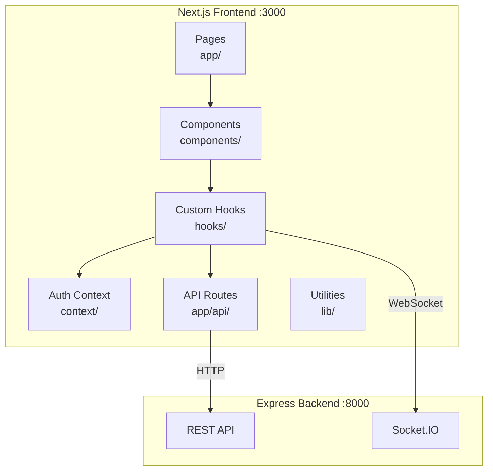
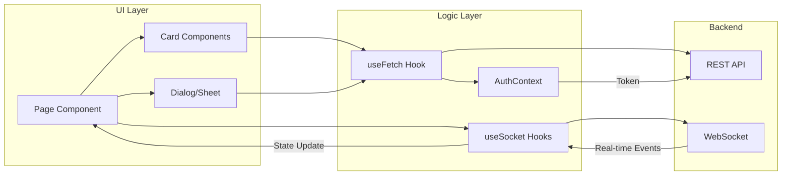
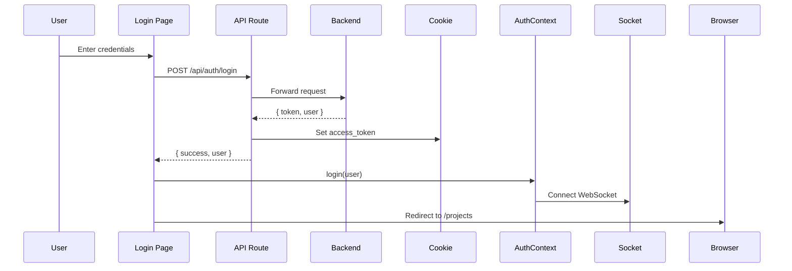

# Real-time Task Manager

A modern, real-time collaborative task management application built with Next.js 16, Socket.IO, and shadcn/ui.

---

## Running Locally

### Prerequisites

- **Node.js** 18.x or higher
- **npm** 9.x or higher
- **Backend server** running on port 8000 (see backend repo)

### Step 1: Clone the Repository

```bash
git clone https://github.com/PratikChakraborty10/realtime-task-manager-frontend.git
cd realtime-task-manager-frontend
```

### Step 2: Install Dependencies

```bash
npm install
```

### Step 3: Configure Environment Variables

Create a `.env.local` file in the root directory:

```env
API_BASE_URL=http://localhost:8000/api/v1
NEXT_PUBLIC_SOCKET_URL=http://localhost:8000
```

### Step 4: Start the Development Server

```bash
npm run dev
```

Open [http://localhost:3000](http://localhost:3000) in your browser.

### Step 5: Build for Production (Optional)

```bash
npm run build
npm start
```

---

## Frontend Architecture

### System Overview



---

### Directory Structure

```
frontend/
├── app/                    # Next.js App Router
│   ├── api/                # BFF API routes (proxy to backend)
│   │   ├── auth/           # Login, signup, logout, profile
│   │   ├── projects/       # Project CRUD, members, tasks
│   │   ├── tasks/          # Task comments
│   │   └── search/         # Global search
│   ├── login/              # Login page
│   ├── signup/             # Signup page
│   ├── profile/            # User profile page
│   └── projects/           # Projects list & detail pages
│       └── [id]/           # Dynamic project detail page
│
├── components/             # React components
│   ├── ui/                 # shadcn/ui base components
│   ├── navbar.tsx          # Global navigation
│   ├── global-search.tsx   # Command palette search
│   ├── project-card.tsx    # Project card in grid
│   ├── task-card.tsx       # Task card in Kanban
│   ├── task-detail-sheet.tsx   # Task side panel
│   ├── create-project-dialog.tsx
│   └── create-task-dialog.tsx
│
├── context/
│   └── auth-context.tsx    # Authentication state & socket management
│
├── hooks/
│   ├── useFetch.ts         # HTTP requests with auth & error handling
│   └── useSocket.ts        # Real-time WebSocket hooks
│
├── lib/
│   ├── cookies.ts          # Cookie utilities
│   ├── socket.ts           # Socket.IO client setup
│   ├── enums.ts            # Shared enums (TaskStatus, ProjectStatus)
│   └── utils.ts            # Utility functions
│
└── docs/                   # API documentation
```

---

### Component Interaction Flow



---

### Key Patterns

#### 1. BFF (Backend-for-Frontend) API Routes

All backend calls go through Next.js API routes. This:
- Keeps the backend URL private
- Handles cookie-based token extraction
- Provides consistent error handling

```
Browser → /api/projects → Backend /api/v1/projects
```

#### 2. Authentication Flow



#### 3. Real-time Updates

Components subscribe to socket events via hooks:

| Hook | Events | Purpose |
|------|--------|---------|
| `useTaskUpdates` | `task:created`, `task:updated`, `task:deleted` | Sync tasks across clients |
| `useProjectUpdates` | `project:updated`, `member:added`, `member:removed` | Sync project changes |
| `useCommentUpdates` | `comment:created`, `comment:deleted` | Sync comments in real-time |

#### 4. Error Handling

`useFetch` automatically:
- Shows error toasts on API failures
- Redirects to login on 401 (session expired)
- Can be disabled per-call with `showErrorToast: false`

---

## Tech Stack

| Category | Technology |
|----------|------------|
| Framework | Next.js 16 (App Router) |
| Language | TypeScript |
| Styling | Tailwind CSS 4 |
| UI Components | shadcn/ui (Radix UI) |
| Icons | Lucide React |
| Real-time | Socket.IO Client |
| Notifications | Sonner |
| State | React Context + Hooks |

---

## Features

- ✅ **Authentication** - JWT-based login/signup with session management
- ✅ **Projects** - CRUD operations with member management
- ✅ **Tasks** - Kanban-style board with drag-and-drop (status)
- ✅ **Comments** - Real-time threaded comments on tasks
- ✅ **Search** - Global search across projects and tasks
- ✅ **Real-time Sync** - Live updates via WebSocket
- ✅ **Pagination** - Cursor-based for scalable data loading

---

## Documentation

| Document | Description |
|----------|-------------|
| [PAGINATION.md](./docs/PAGINATION.md) | Cursor-based pagination guide |
| [SEARCH_API.md](./docs/SEARCH_API.md) | Global search implementation |
| [PROJECT_FILTER_API.md](./docs/PROJECT_FILTER_API.md) | Project filtering options |
| [REALTIME_PROJECT_EVENTS.md](./docs/REALTIME_PROJECT_EVENTS.md) | WebSocket events reference |
| [PROJECT_MEMBERS.md](./docs/PROJECT_MEMBERS.md) | Member management APIs |
